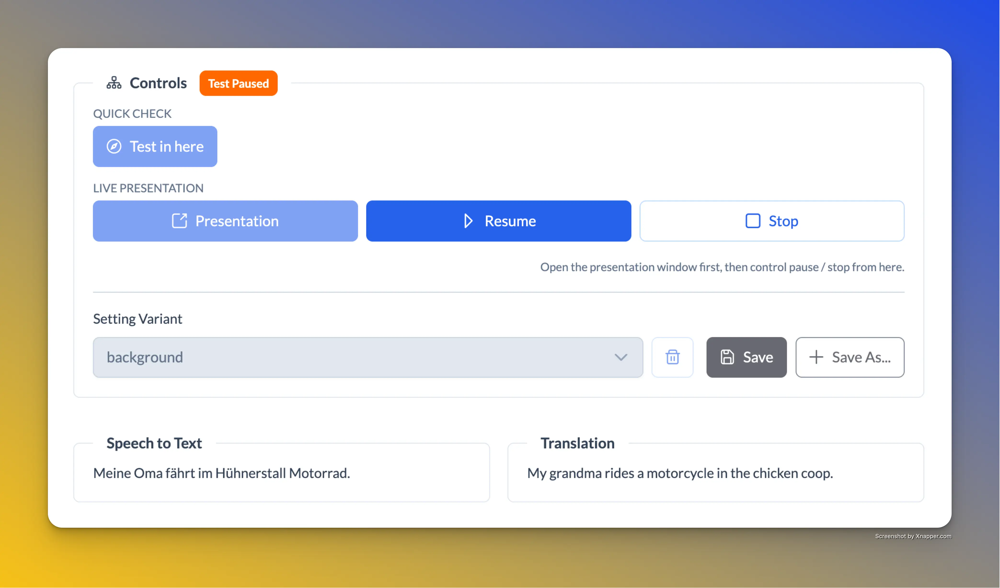
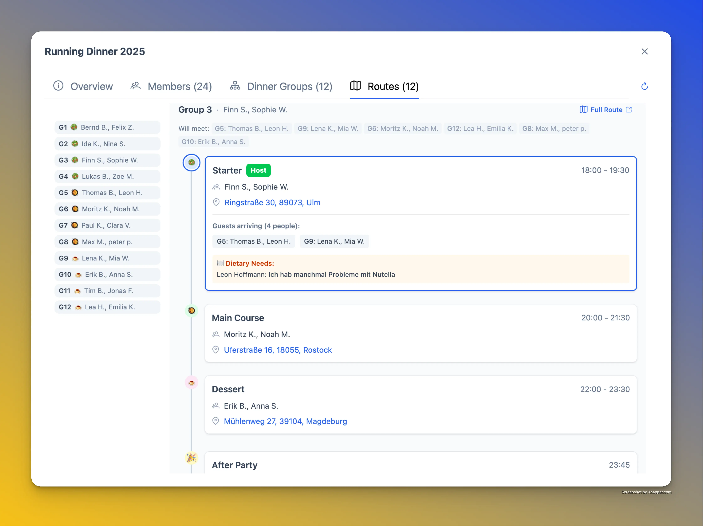
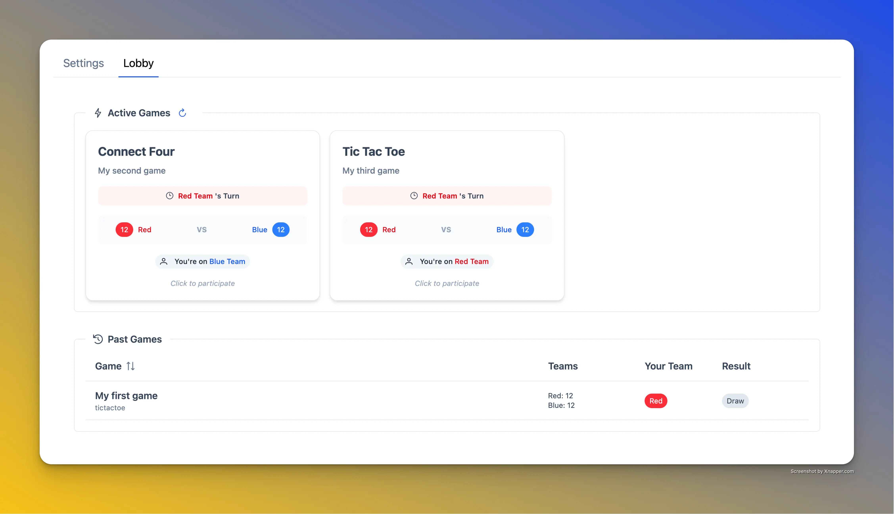

# ChurchTools Extensions

A collection of extensions for [ChurchTools](https://church.tools/) – the church management software used by thousands of churches across Germany and beyond.

> [!IMPORTANT]
> AI is heavily involved in creating and maintaining these extensions. While I strive for accuracy, please test thoroughly before deploying in a production environment.

## Table of Contents

- [What are ChurchTools Extensions?](#what-are-churchtools-extensions)
- [Available Extensions](#available-extensions)
  - [🎤 Translator](#-translator)
  - [🍽️ Running Dinner Groups](#️-running-dinner-groups)
  - [🎮 Community Games](#-community-games)
- [Releases](#releases)
- [For Developers](#for-developers)
  - [Repository Structure](#repository-structure)
  - [Shared Packages](#shared-packages)
  - [Getting Started](#getting-started)
  - [Adding a New Extension](#adding-a-new-extension)
- [Support](#support)

## What are ChurchTools Extensions?

ChurchTools is a comprehensive platform for managing church operations: member databases, group management, event planning, service scheduling, and more. While ChurchTools covers the essentials, every church has unique needs.

**Extensions** fill those gaps. They are web applications that integrate seamlessly with ChurchTools, appearing as additional modules within the interface. Extensions can:

- Access ChurchTools data (people, groups, events) through the official API
- Store extension-specific data using ChurchTools' Custom Module storage
- Match the ChurchTools look and feel for a seamless user experience
- Add completely new functionality tailored to your church's needs

This repository is a monorepo containing multiple extensions, each designed to solve a specific problem. Its based on the [extension-boilerplate](https://github.com/churchtools/extension-boilerplate) repository which provides the basic structure and tooling for building ChurchTools extensions.

> [!NOTE]
> ChurchTools is working on allowing even more integration points for extensions in the future, like deeper UI embedding (widgets) and event hooks. I will update the extensions as those features become available.

---

## Available Extensions

### 🎤 [Translator](./extensions/translator/)

> **Extension Key:** `translator`

Real-time speech-to-text translation for multilingual services.

Perfect for churches with international members who need live translation during services. Uses Microsoft Azure's Speech Services to convert spoken words into translated text displayed on screen/projector or stream. Maybe I will add broadcasting to attendee devices in the future as well as speech-to-speech translation and multi-language-output.

**Features**: Real-time transcription • Lots of customization options • Presentation mode • Session logging

<table>
  <tr>
    <td></td>
    <td></td>
    <td></td>
  </tr>
</table>

→ [Read more](./extensions/translator/README.md) • [Releases](https://github.com/BoThomas/churchtools-extensions/releases?q=ct-translator)

---

### 🍽️ [Running Dinner Groups](./extensions/running-dinner-groups/)

> **Extension Key:** `runningdinnergroups`

> [!CAUTION]
> This is in BETA and not fully tested yet.

Running Dinner with deep ChurchTools group integration.

An alternative version of Running Dinner that uses ChurchTools' native group management. Participants register by joining ChurchTools groups, and all data lives within the ChurchTools ecosystem.

**Features**: ChurchTools group integration • Custom field-based registration • Email notifications • Same powerful grouping and routing algorithms

<table>
  <tr>
    <td></td>
    <td></td>
    <td></td>
  </tr>
</table>

→ [Read more](./extensions/running-dinner-groups/README.md) • [Releases](https://github.com/BoThomas/churchtools-extensions/releases?q=ct-running-dinner-groups)

---

### 🎮 [Community Games](./extensions/community-games/)

> **Extension Key:** `communitygames`

Team-based casual games for community events.

Bring your community together with interactive games! Teams vote on moves together, making it perfect for youth groups, church festivals, or online events.

**Games**: TicTacToe • Connect Four • More to come...
**Features**: Team voting • Multiple simultaneous games • Live updates • Works on mobile

<table>
  <tr>
    <td></td>
    <td></td>
    <td></td>
  </tr>
</table>

→ [Read more](./extensions/community-games/README.md) • [Releases](https://github.com/BoThomas/churchtools-extensions/releases?q=ct-community-games)

---

### 🍽️ [Running Dinner](./extensions/running-dinner/) ⚠️ DEPRECATED

<details>
<summary>Details</summary>

> **DEPRECATED** – This extension is no longer maintained and will not receive updates.
>
> **Extension Key:** `runningdinner`

Organize progressive dinner events where participants travel between homes for each course.

A Running Dinner is a social event where groups host one course (starter, main, or dessert) at their home while visiting other homes for the remaining courses. Great for building community connections!

**Features**: Event management • Participant registration • Smart group creation • Route optimization • Communication tools

→ [Read more](./extensions/running-dinner/README.md)

</details>

---

## Releases

Download ready-to-install extension packages from the [GitHub Releases](https://github.com/BoThomas/churchtools-extensions/releases) page.

**Filter by extension:**

| Extension             | Releases                                                                                                                    |
| --------------------- | --------------------------------------------------------------------------------------------------------------------------- |
| Translator            | [ct-translator releases](https://github.com/BoThomas/churchtools-extensions/releases?q=ct-translator)                       |
| Running Dinner Groups | [ct-running-dinner-groups releases](https://github.com/BoThomas/churchtools-extensions/releases?q=ct-running-dinner-groups) |
| Community Games       | [ct-community-games releases](https://github.com/BoThomas/churchtools-extensions/releases?q=ct-community-games)             |

---

## For Developers

This is a **pnpm monorepo** using **Turborepo** for build orchestration. Extensions are built with **Vue 3**, **TypeScript**, and **Vite**.

### Repository Structure

```
churchtools-extensions/
├── extensions/                # Extension applications
│   ├── translator/            # Speech-to-text translation
│   ├── running-dinner/        # Running Dinner (DEPRECATED)
│   ├── running-dinner-groups/ # Running Dinner Groups
│   └── community-games/       # Interactive games
├── packages/                  # Shared internal packages
│   ├── ct-utils/              # ChurchTools API utilities
│   ├── persistance/           # Data persistence layer
│   ├── prime-volt/            # Themed UI components
│   ├── build-tools/           # Build and packaging tools
│   └── shared-styles/         # Common CSS styles
├── certs/                     # Local HTTPS certificates
├── docs/                      # Documentation
└── releases/                  # Built extension packages
```

### Shared Packages

| Package                                 | Description                                                   |
| --------------------------------------- | ------------------------------------------------------------- |
| `@churchtools-extensions/ct-utils`      | ChurchTools API utilities, KV store wrapper, type definitions |
| `@churchtools-extensions/persistance`   | High-level data persistence with CRUD operations              |
| `@churchtools-extensions/prime-volt`    | Themed PrimeVue components matching ChurchTools design        |
| `@churchtools-extensions/build-tools`   | Packaging scripts and version info Vite plugin                |
| `@churchtools-extensions/shared-styles` | Common CSS styles                                             |

### Getting Started

#### Prerequisites

- Node.js
- pnpm (`npm install -g pnpm`)

#### Installation

```bash
# Clone the repository
git clone https://github.com/BoThomas/churchtools-extensions.git
cd churchtools-extensions

# Install dependencies
pnpm install
```

#### Development

```bash
# Start a specific extension
pnpm dev --filter=ct-translator

# Or run all extensions from root
pnpm dev
```

#### Local HTTPS Setup

Extensions require HTTPS for local development. We use [mkcert](https://github.com/FiloSottile/mkcert) for locally-trusted certificates.

**Install mkcert:**

```bash
# macOS
brew install mkcert

# Linux (Debian/Ubuntu)
sudo apt install libnss3-tools
curl -JLO "https://dl.filippo.io/mkcert/latest?for=linux/amd64"
chmod +x mkcert-v*-linux-amd64
sudo mv mkcert-v*-linux-amd64 /usr/local/bin/mkcert

# Windows (Chocolatey)
choco install mkcert

# Windows (Scoop)
scoop install mkcert
```

**Generate certificates:**

```bash
# Install local CA (once per machine)
mkcert -install

# Generate certificates
mkdir certs && cd certs
mkcert localhost 127.0.0.1 ::1
mv localhost+2-key.pem localhost-key.pem
mv localhost+2.pem localhost.pem
```

The `certs/` folder is gitignored – each developer generates their own certificates.

#### ChurchTools CORS Configuration

For local development, configure CORS in your ChurchTools instance:

1. Go to **Admin → API Settings → Integration → Cross-Origin Resource Sharing**
2. Add e.g. `https://localhost:5173` to allowed origins

#### Local packaging (optional)

```bash
# build and package all extensions
pnpm deploy

# build and package a specific extension
pnpm deploy --filter=ct-translator
```

Packaged extensions are placed in the `releases/` directory.

#### Building & Releasing Extensions

The release tool provides an interactive workflow for creating releases with proper versioning, changelogs, and GitHub releases.

**Prerequisites:**

- [GitHub CLI](https://cli.github.com/) (`gh`) for creating GitHub releases (optional, but recommended)

  ```bash
  # macOS
  brew install gh

  # Then authenticate
  gh auth login
  ```

**Usage:**

```bash
# Run the interactive release tool
pnpm release
```

The release tool will:

1. Let you select one or more extensions to release
2. Show commits since the last release for each extension
3. Prompt for semver bump (patch/minor/major)
4. Prompt for a release summary
5. Update `package.json` version
6. Create a git commit and annotated tag (`<pkg-name>@<version>`)
7. Build and package the extension
8. Generate/update `CHANGELOG.md`
9. Optionally create a GitHub release with the ZIP attached
10. Optionally push commits and tags

### Adding a New Extension

1. Create a new directory in `extensions/`
2. Set up `package.json` with workspace package dependencies:
   ```json
   {
     "dependencies": {
       "@churchtools-extensions/ct-utils": "workspace:*",
       "@churchtools-extensions/persistance": "workspace:*",
       "@churchtools-extensions/prime-volt": "workspace:*"
     }
   }
   ```
3. Import shared packages in your code:
   ```ts
   import { PersistanceCategory } from '@churchtools-extensions/persistance';
   import Button from '@churchtools-extensions/prime-volt/Button.vue';
   ```

## Support

For questions about the ChurchTools API, visit the [ChurchTools Forum](https://forum.church.tools). My username is [bothomas](https://forum.church.tools/user/bothomas).
