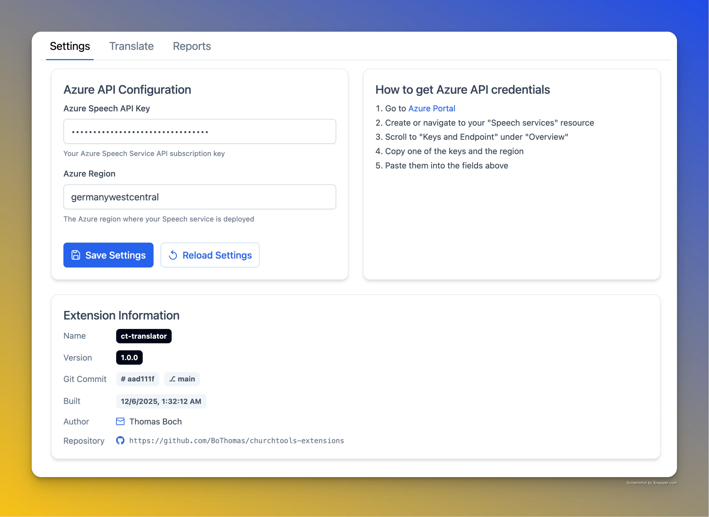
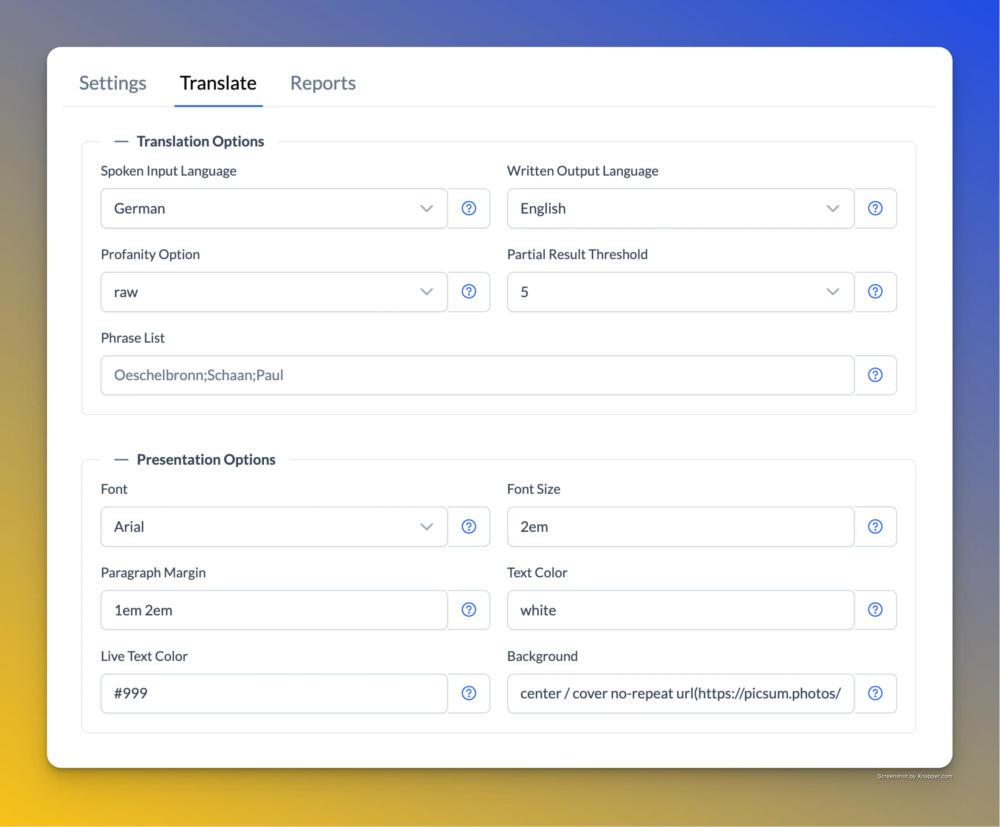
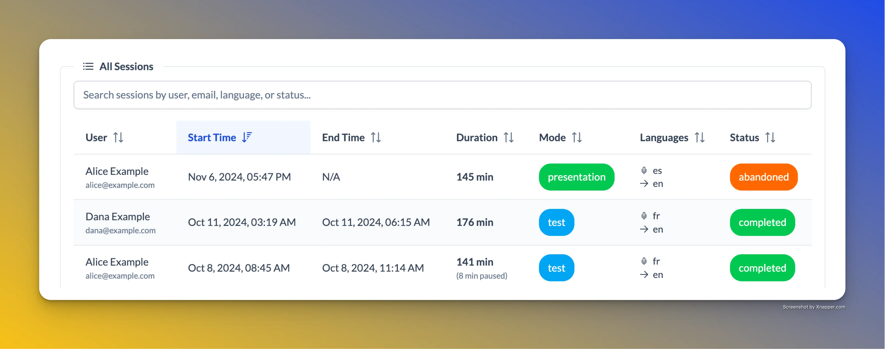
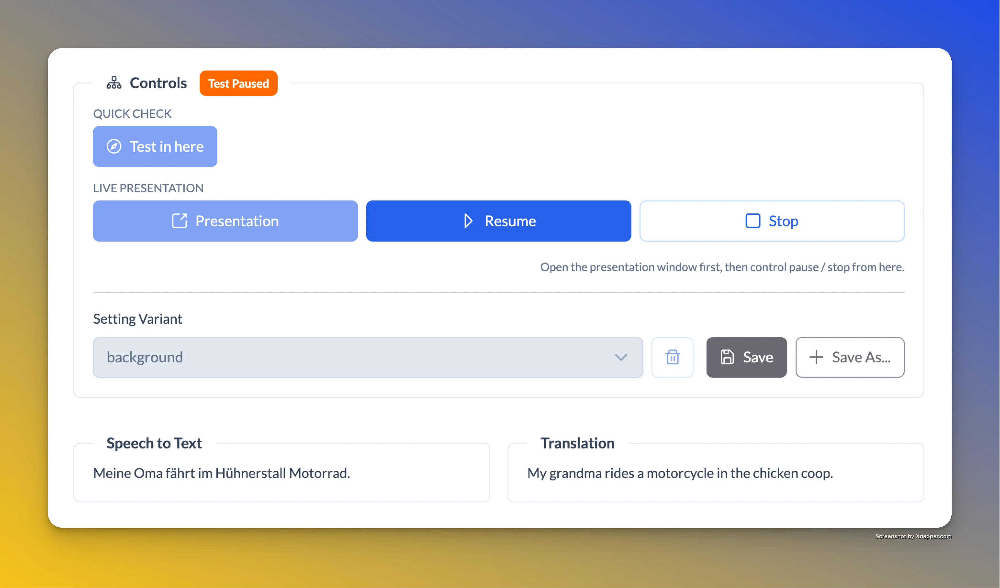
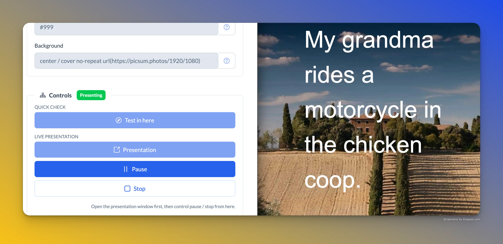
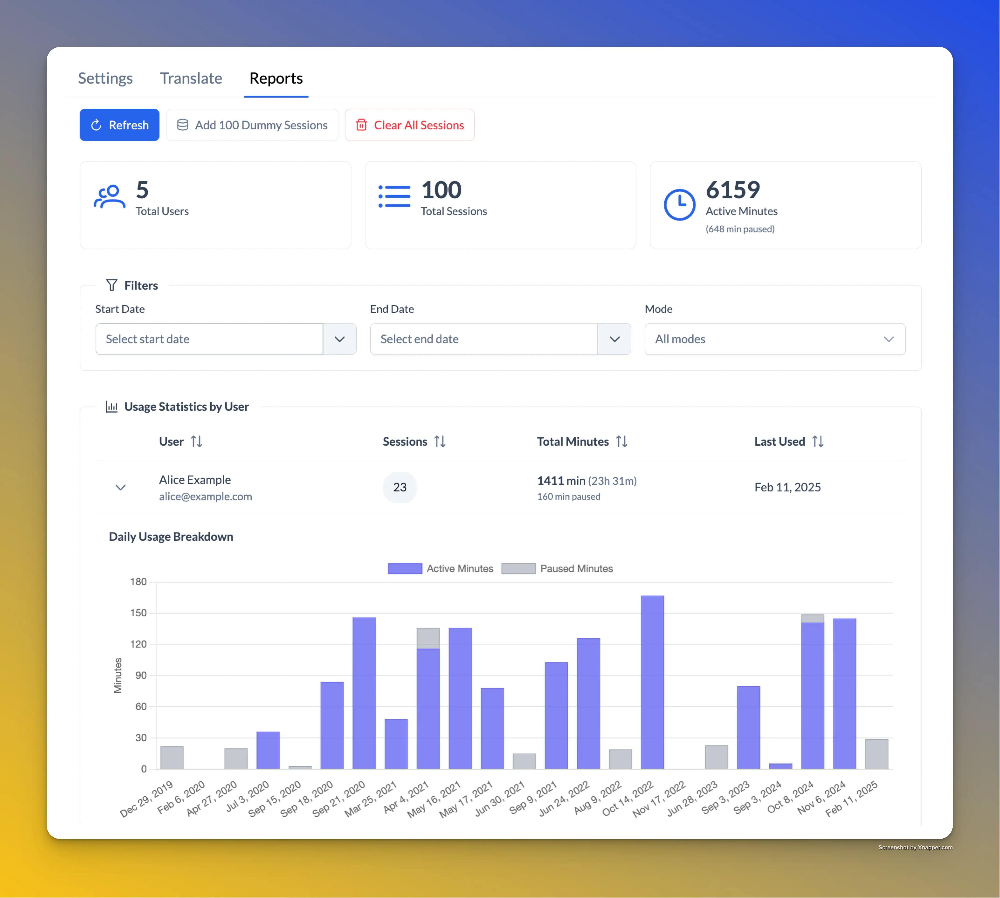

# ChurchTools Translator

Real-time speech-to-text translation for church services and events, powered by Microsoft Foundry (formerly Cognitive Services) "Speech-Service".

> [!IMPORTANT]
> **Extension Key:** `translator` — You'll need this key when installing the extension in ChurchTools.

> [!WARNING]
> As the Presentation Mode is also embedded in the ChurchTools interface, there could be problems with
> Pop-ups or other conditional overlays not being suppressed. This needs to be tested further.

→ [Download Releases](https://github.com/BoThomas/churchtools-extensions/releases?q=ct-translator)

## Screenshots

<table>
  <tr>
    <td></td>
    <td></td>
    <td></td>
  </tr>
</table>

<table>
  <tr>
    <td></td>
    <td></td>
    <td></td>
  </tr>
</table>

## What is it?

The Translator extension enables real-time translation of spoken language during church services. It's perfect for multilingual congregations where members may not understand the primary language of the service.

**Example Use Case**: Your church has German-speaking visitors during an English service. A translator speaks into a microphone, and the translation appears instantly on a screen.

## Features

### 🎤 Real-Time Speech Recognition

- Captures speech and converts it to text in real-time
- Supports multiple input languages
- Translates speech into multiple target languages
- Works with any microphone input going into a PC running ChurchTools-Website

### 📺 Presentation Mode

- Full-screen display optimized for projection
- Customizable font size, colors, and styling
- Clean, distraction-free interface

### 📊 Session Logging

- Track usage statistics per session
- Review translation history
- Monitor API usage

## How It Works

1. **Configure** your Azure Speech API credentials in the Settings tab
2. **Select** your source and target languages
3. **Start** the presentation mode
4. **Speak** into the microphone - text appears on screen in real-time

## Requirements

- A ChurchTools instance with Extension support
- Microsoft Azure account with a ["Speech-Service" Resource](https://azure.microsoft.com/en-us/pricing/details/cognitive-services/speech-services/) (you can start with a free tier for 5h/month of speech-to-text)
- A microphone for the speaker/translator plugged into the PC running ChurchTools-Website
- A screen or projector for displaying translations

> [!NOTE]
> The presentation mode has only been tested on Chromium-based browsers (Chrome, Edge, Brave ...). Other browsers may work but could experience unexpected behavior.

## Azure Setup

You have two options for setting up the required Azure infrastructure:

### Option A: Automated Setup (Recommended)

Use the interactive CLI tool to automatically provision all required Azure resources:

```bash
pnpm run --filter @churchtools-extensions/translator-infra setup
```

This will guide you through:

- Creating a Speech Service resource
- (OPTIONAL) Setting up Web PubSub for real-time communication
- Generating and displaying all necessary API keys

For detailed documentation, see the [translator-infra README](../../packages/translator-infra/README.md).

### Option B: Manual Setup

1. Go to [Azure Portal](https://portal.azure.com)
2. Create a "Speech Services" resource
3. Navigate to "Keys and Endpoint" under the resource overview
4. Copy one of the keys and the region
5. Enter them in the extension's Settings tab
